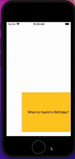

## Lab 3

### App Description
A Simple flashcards app that lets you save flashcards and come back to it later

### App Walk-though

 

## Required
- [ ] User can browse through multiple flashcards
- [ ] User can re-open the app and see previously created flashcards
- [ ] Push code to GitHub
## Optional
- [ ] User can delete a flashcard
- [ ] User can edit existing flashcard
- [ ] User can store multiple choice questions
